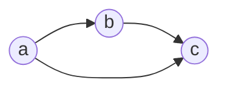
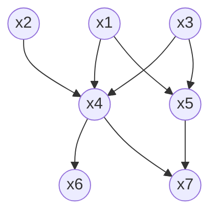
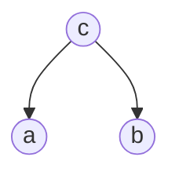
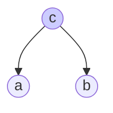
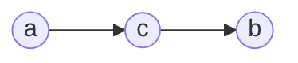
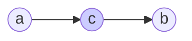
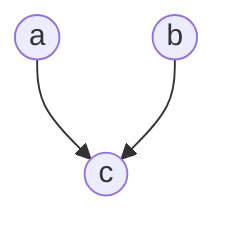
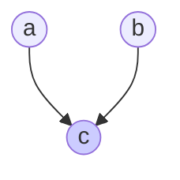
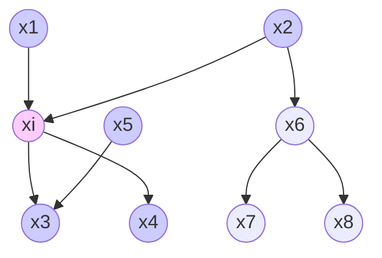


       
# 贝叶斯网络

- 贝叶斯网络概念
- 条件独立性
- D-separation与Markov Blanket
- 图模型与完整条件概率表的参数比较
- 常见概率图模型

---
### *1. 贝叶斯网络概念*

分析概率模型时，使用概率分布的图形表示会让分析过程更简单直观，这种概率分布的图形表示被称为概率图模型（probabilistic graphical models）。在概率图模型中，每个结点表示一个随机变量（或一组随机变量），链接表示这些变量之间的概率关系。

贝叶斯网络（Bayesian network），也被称为有向图模型（Directed graphical model）。这个模型中，图之间的链接有一个特定的方向，使用箭头表示，用来刻画变量之间的依赖关系，并使用条件概率表（Conditional Probability Table）来描述变量的联合概率分布。

首先，回顾概率的链式法则，对于$K$个变量的联合概率分布$p(x_1,...,x_K)$，通过重复使用概率的乘积规则，联合概率分布可以写成条件概率的乘积
$$p(x_1,...,x_K)=p(x_1)\prod_{k=2}^K{p(x_k|x_1,...,x_{k-1})}$$
对于一个给定的$K$，我们可以将其表示为一个具有$K$个结点的有向图，每个结点对应于公式右侧的一个条件概率分布，每个结点的输入链接包括所有以编号低于当前结点编号的结点为起点的链接（这里隐式地选择了一个特定的顺序，如果选择不同顺序，可以得到不同的图表示）。可以发现，每对结点之间都存在一个链接，所以这个图是全连接的（fully connected）。

例如，我们考虑三个变量$a,b,c$的联合分布$p(a,b,c)$的情况，我们可以将联合分布表示为
$$p(a,b,c)=p(c|a,b)p(b|a)p(a)$$
它对应的图模型为

上面公式的操作对象是一般的联合概率分布，没有给出任何限制信息，图是全连接的。下面考虑图中链接的缺失，正是这些缺失的链接传递了概率分布的性质信息。例如，对于下面的图

它对应的联合概率分布为

$$p(x_1)p(x_2)p(x_3)p(x_4|x_1,x_2,x_3)p(x_5|x_1,x_3)p(x_6|x_4)p(x_7|x_4,x_5)$$

在图的所有结点上定义的联合概率分布由每个结点上的条件概率分布的乘积表示，每个条件概率分布的条件都是图中结点的父节点所对应的变量。因此，对于一个有$K$个结点的图，联合概率为

$$p(\pmb{x})=\prod_{k=1}^K{p(x_k|pa_k)}$$

其中，$pa_k$表示$x_k$的父结点的集合，$\pmb{x}=\{x_1,...,x_K\}$。贝叶斯网络有效地表达了变量之间的条件独立性，给定父结点集，贝叶斯网假设每个变量与它的非后裔变量独立。

为了表示复杂的概率图模型，通常会遵循下面惯例：随机变量由空心圆表示，确定性参数由小的实心点表示，观测变量由对应空心圆加上阴影表示，同时，可以使用板（plate）的方框将一个变量结点圈起来，标注为$N$，表示有$N$个同类型的点。

---
### *2. 条件独立性*

如果$P(X,Y|Z)=P(X|Z)P(Y|Z)$，或等价地$P(X|Y,Z)=P(X|Z)$，则称事件$X,Y$对于给定事件$Z$是条件独立的，也就是说，当$Z$发生时，$X$发生与否与$Y$发生与否是无关的。

重新观察上面缺失链接的概率图的例子，我们可以发现，在给定$x_4$的条件下，$x_6$与$x_7$是独立的。这个例子包含了贝叶斯网络中变量之间的三种典型依赖关系，这里把这三种关系提取出来，用三个变量$a,b,c$表示方便探讨。

#### A) 尾到尾（tail-to-tail）

上图的联合概率分布为
$$p(a,b,c)=p(a|c)p(b|c)p(c)$$
如果没有观测变量，为了考察$a$与$b$是否相互独立，对两边进行积分或求和，得
$$p(a,b)=\sum_{c}{p(a|c)p(b|c)p(c)}$$
一般地，这不能分解为乘积$p(a)p(b)$，所以$a$与$b$在没有观测变量情况下不总是条件独立的（相当于此时的条件为$\empty$）。
现在假设以变量$c$为条件，那么在给定$c$的条件下，$a$与$b$的条件概率分布为
$$p(a,b|c)= \frac{p(a,b,c)}{p(c)} = p(a|c)p(b|c)$$
因此，可以得到，$a$与$b$在给定$c$的条件下是条件独立的。如下图所示，结点$c$被称为关于这个路径“尾到尾（tail-to-tail）”。这样的一个连接结点$a$与结点$b$的路径的存在使得结点相互依赖。然而，当我们以结点$c$为条件时，被用作条件的结点“阻隔”了从$a$到$b$的路径，使得$a$与$b$变得（条件）独立了。

#### B) 头到尾（head-to-tail）

上图的联合概率分布为
$$p(a,b,c)=p(a)p(c|a)p(b|c)$$
与上面“尾到尾”情况相同，$a$与$b$在没有观测变量情况下不总是条件独立的，在给定$c$的条件下是条件独立的。如下图所示，结点$c$被称为关于这个路径“头到尾（head-to-tail）”。这样的一个连接结点$a$与结点$b$的路径的存在使得结点相互依赖。然而，当我们以结点$c$为条件时，被用作条件的结点“阻隔”了从$a$到$b$的路径，使得$a$与$b$变得（条件）独立了。

#### C) 头到头（head-to-head）

上图的联合概率分布为
$$p(a,b,c)=p(a)p(b)p(c|a,b)$$
如果没有观测变量，为了考察$a$与$b$是否相互独立，对两边进行积分或求和，得
$$p(a,b)=p(a)p(b)\sum_{c}{p(c|a,b)}=p(a)p(b)$$
与上面两种情况不同，$a$与$b$在没有观测变量情况下条件独立。
现在假设以变量$c$为条件，无法被分解为$p(a|c)p(b|c)$，此时$a$与$b$在给定$c$的条件下是不总是条件独立的。

因此，在第三种关系中，结点$c$关于从$a$到$b$的路径是“头到头（head-to-head）”的，当结点$c$没有被观测到的时候，它“阻隔”了路径，从而变量$a$和$b$是独立的。然而，以$c$为条件时，路径被“解出隔离”，使得$a$和$b$相互依赖了。

总之，一个尾到尾结点或者头到尾结点使得一条路径没有阻隔，除非它被观测到，之后它就阻隔了路径。相反，一个头到头结点如果没有被观测到，那么它阻隔了路径，但是一旦这个节点或者至少一个后继被观测到，那么路径就被“解除阻隔”了。

---
### *3.D-separation与Markov Blanket*

#### D-separation

为了分析有向图中变量间的条件独立性，可使用“有向分离(D-separation)”。考虑一个一般的有向图，其中$A,B,C$是任意无交集的结点集合（它们的并集可能比图中结点的完整集合要小）。为了了解一个有向无环图是否暗示了一个特定的条件依赖表述${A}\perp{B}|C$（$A$与$B$在给定$C$的条件下条件独立），考虑从$A$中任意结点到$B$中任意结点的所有可能的路径。我们说这样的路径被“阻隔”，如果它包含满足下面两个性质中的任何一个节点。

- 路径上的箭头以头到尾或者尾到尾的方式交汇于这个结点，且这个结点在集合$C$中。
- 箭头以头到头的方式交汇于这个结点，且这个结点和它的所有后继都不在集合$C$中。

如果所有的路径都被“阻隔”，那么我们说$C$把$A$从$B$中有向分离了，且图中所有变量上的联合概率分布将会满足${A}\perp{B}|C$。

实际上，上面判断有向分离的方法比较繁琐，可以引入“道德图”方法。
首先，把有向图转化为无向图：
- 找出有向图中的所有“头到头”结构，在该结构的两个父结点之间加上一条无向边；
- 将所有有向边改为无向边

由此产生的无向图称为“道德图”，基于道德图能直观迅速找到变量之间的条件独立性。假定道德图中有变量$a,b$和变量集合$\pmb{c}=\{c_i\}$，若变量$a$和$b$能在图上被$\pmb{c}$分开，即从道德图中将变量集合$\pmb{c}$去除后，$a$和$b$分属两个联通分支，则称变量$a$和$b$被$\pmb{c}$有向分离，${a}\perp{b}|\pmb{c}$。

D-separation的实例，可以考虑朴素贝叶斯的例子，其关键假设是，以类别$z$为条件，输入变量$x_1,x_2,...,x_D$的分布是独立的，模型的图表示如下。可以看到$z$的观测阻隔了从$x_i$到$x_j$的路径，因为这样的路径在结点$z$处是尾到尾的。因此给定$z$的条件下，$x_i$和$x_j$是条件独立的。
然而，如果我们对$z$求和或积分（即$z$不再是观测变量），那么从$x_i$到$x_j$的尾到尾路径就不再是阻隔的了。所以，通常边缘概率密度$p(\pmb x)$不能关于$\pmb x$的元素进行分解。

#### Markov Blanket

在随机变量的全集$U$中，对于给定的变量${X}\in{U}$和变量集${MB}\subset{U}(X\not\in{MB})$，若有
$$X\perp{\{U-MB-\{X\}\}}|MB$$
则称能满足上述条件的最小变量集$MB$为$X$的Markov Blanket。
形象一点说，把一个随机变量全集$U$分成互斥的三部分，变量$X$以及集合$A$和$B$，三个子集没有交集，并集即为全集$U$；如果说给定集合$A$时，变量$X$与集合$B$没有任何关系，并且要求这样的集合$A$是满足条件的最小集合，则称集合$A$为变量$X$的Markov Blanket。在上面公式中，集合$MB$即为集合$A$，${\{U-MB-\{X\}\}}$即为集合B。

在一个随机变量的全集$U$中，由于在目标变量$X$的Markov Blanket $MB(X)$条件下，$X$和其非Markov Blanket变量条件独立，因此对于$X$而言，所有非Markov Blanket变量都是冗余的，关于目标变量$X$的所有信息都包含在$X$的Markov Blanket中。如果需要了解目标变量的分布情况，仅需要了解其Markov Blanket的信息即可，而不需要了解整个数据集。
特征选择就是从一个原始的特征空间中选择一个最优特征子集的过程，这个特征子集应该保留原始特征空间的全部或大部分信息。它的主要任务是去除两种主要类型的特征：不相关特征和冗余特征。Markov Blanket是进行特征冗余性分析的一种常用工具。在一个特征空间中，目标特征的Markov Blanket包含了其所有信息。通过发现目标特征的Markov Blanket，可以准确确定目标特征的冗余特征，从而降低特征空间的维度。

在贝叶斯网络中，一个结点的父结点、子结点、同父结点组成的结点集合被称为Markov Blanket。
考虑一个联合概率分布$p(\pmb{x_1},...,\pmb{x_D})$，它由一个具有$D$个结点的有向图表示。考虑变量$\pmb{x_i}$对应的结点上的条件概率分布，其中条件为所有剩余的变量$\pmb{x_{j\ne{i}}}$，使用贝叶斯网络的分解性质，可将条件概率表示为
$$p(\pmb{x_i}|\pmb{x_{j\ne{i}}}) = {\frac{p(\pmb{x_1},...,\pmb{x_D})} {\int{p(\pmb{x_1},...,\pmb{x_D})}d\pmb{x_i}}} = {\frac{\prod_{k}{p(\pmb{x_k}|pa_k)}} {\int{\prod_{k}{p(\pmb{x_k}|pa_k)}d\pmb{x_i}}}}$$
将上式中任何与$\pmb{x_i}$没有函数依赖关系的因子都可以提到$\pmb{x_i}$积分外面，从而在分子和分母之间消去。唯一剩余的因子是节点$\pmb{x_i}$本身的条件概率分布$p(\pmb{x_i}|pa_i)$，以及满足下面性质的结点$\pmb{x_k}$的条件概率分布：结点$\pmb{x_i}$在$p(\pmb{x_k}|pa_k)$的条件集合中，即$\pmb{x_i}$是$\pmb{x_k}$的父结点。条件概率分布$p(\pmb{x_i}|pa_i)$依赖于结点$\pmb{x_i}$的父结点，而条件概率分布$p(\pmb{x_k}|pa_k)$依赖于$\pmb{x_i}$的子结点以及同父结点。

---
### *4.图模型与完整条件概率表的参数比较*

这里，通过讨论有向图中的父结点和子结点都对应于离散变量的情形，以及它们都对应于高斯变量的情形，来考虑图模型联合概率的分解属性和原始的链式法则联合概率表的参数量级。
对于$K$个结点的图，联合概率的分解属性已经给出
$$p(\pmb{x})=\prod_{k=1}^K{p(x_k|pa_k)}$$

#### A) 离散变量
对于有$K$个可能状态（使用“1-of-$K$”表达方式）的一元离散变量$\pmb{x}$，概率$p(\pmb{x}|\pmb{\mu})$为
$$p(\pmb{x}|\pmb{\mu}) = \prod_{k=1}^K{\mu_k^{x_k}}$$
由参数$\pmb{\mu}=(\mu_1,...,\mu_K)^T$控制。由于限制条件$\sum_{k}{\mu_k}=1$，所以我们需要指定$K-1$个$\mu_k$的值即可。

如果有$M$个离散变量$\pmb{x_1},...,\pmb{x_M}$，可以使用有向图对联合概率分布建模。如果图是全连接的，将联合概率分解为$p(\pmb{x_M|x_1,...,x_{M-1}})...p(\pmb{x_2|x_1})p(\pmb{x_1})$，边缘概率分布$p(\pmb{x_1})$与上面相同，由$K-1$个参数控制。根据条件概率表，条件概率分布$p(\pmb{x_2|x_1})$在确定了$\pmb{x_1}$的$K$个可能取值的前提下，每种取值对应$K-1$种可能，即需要指定的参数个数为$K(K-1)$。依次类推，条件概率$p(\pmb{x_M|x_1,...,x_{M-1}})$需要指定的参数个数为$K^{M-1}(K-1)$。在联合概率分布中，需要指定的参数的总数为$\sum_{i=1}^M{K^{i-1}(K-1)} = K^M-1$。

如果图中不存在链接，那么联合概率分布可以分解为边缘概率分布的乘积，参数总数为$M(K-1)$。连接度处于二者之间的图，参数数量也会比一般的联合概率分布的参数数量少。
可以看到，使用条件概率表，或者使用链式法则得到完全连接的概率图，参数模型的数量是随变量个数指数增长的。而使用图模型，给定父结点集，假设每个变量与它的非后裔变量独立时，可以让参数数量朝着随变量个数线性增长的方向变化。

另一种控制离散变量模型参数数量的指数增长的方式是对条件概率分布使用参数化的模型，而不是使用概率值的完整表格。

#### B) 线性高斯模型

考虑$D$个变量上的任意的有向无环图，其中结点$i$表示服从高斯分布的一元连续随机变量$x_i$。这个分布的均值是结点$i$的父结点$pa_i$的状态的线性组合，即
$$p(x_i|pa_i)=N(x_i|\sum_{j\in{pa_i}}{w_{ij}x_j+b_i}, v_i)$$
其中$w_{ij}$和$b_i$是控制均值的参数，$v_i$是$x_i$的条件概率分布的方差。这样，联合概率分布的对数为图中所有结点上的这些条件分布的乘积的对数，因此形式为
$$\ln{p}(\pmb{x})=\sum_{i=1}^D{\ln p(x_i|pa_i)} = - \sum_{i=1}^D{\frac{1}{2v_i}(x_i-\sum_{j\in{pa_i}}{w_{ij}x_j}-b_i)^2} + 常数$$
其中$\pmb{x}=(x_1,...,x_D)^T$。这是$\pmb{x}$的元素的二次函数，因此联合概率分布$p(\pmb{x})$是一个多元高斯分布。
可以递归地确定联合概率分布的均值和方差。每个变量$x_i$的概率分布都是（以父结点状态为条件的）高斯分布。因此
$$x_i=\sum_{j\in{pa_i}}{w_{ij}x_j+b_i+\sqrt{v_i}\epsilon_i}$$，其中，$\epsilon_i$是一个零均值单位方差的高斯随机变量，满足$\mathbb{E}[\epsilon_i]=0且{E}[\epsilon_i\epsilon_j]=I_{ij}$，其中$I_{ij}$是单位矩阵的第$i,j$个元素。对上式取期望，得
$$\mathbb{E}[x_i]=\sum_{j\in{pa_i}}{w_{ij}\mathbb{E}[x_j]+b_i}$$
这样，从一个序号最低的结点开始，沿着图递归地计算，就可以求出$\mathbb{E}[\pmb{x}]=(\mathbb{E}[x_i],...,\mathbb{E}[x_D])^T$的各个元素。这里，假设所有结点的序号都大于它的父结点的序号。类似地，可以递归的得到$p(\pmb{x})$的协方差矩阵的第$i,j$个元素，即
$$cov[x_i,x_j]=\mathbb{E}[(x_i-\mathbb{E}[x_i])(x_j-\mathbb{E}[x_j])] $$$$= \mathbb{E}[(x_i-\mathbb{E}[x_i])\{\sum_{k\in{pa_j}}{w_{jk}(x_k-\mathbb{E}[x_k])}+\sqrt{v_j}\epsilon_j\}]=\sum_{k\in{pa_j}}{w_{jk}cov[x_i,x_k]+I_{ij}v_j}$$
因此，协方差可以从序号最低的结点开始，递归地计算。

假设图中不存在链接，则不存在参数$w_{ij}$，因此只有$D$个参数$b_i$和$D$个参数$v_i$。联合概率分布总计有$2D$个参数。

对于全连接的图，矩阵$w_{ij}$为主对角线上没有元素的下三角矩阵，$w_{ij}$矩阵中参数个数为$\frac{D(D-1)}{2}$，还需要加上$D$个参数$b_i$和$D$个参数$v_i$。

---
### *5.常见概率图模型*

#### A) Bayesian inference的基本框架

$$P(\theta|D)=\frac{p(D|\theta)p(\theta)}{\int{p(D|\theta)p(\theta)d\theta}}$$

这里$D$为观察到的数据，$\theta$是参数。

- 在MLE问题求解中，$\theta$是一个特定的待求解的值。此时也可以将$p(D|\theta)$表示为$p(D;\theta)$以强调$\theta$具有特定的值，而不是一个随机变量。
$${\arg\max_{\theta}\log{p(D;\theta)}}$$
- 在Full bayesian inference问题中，是$\theta$个随机变量，$p(\theta)$是其对应的先验分布。

#### B) Gaussian Model
简单的Gaussian模型参数是特定的值，而不是具有先验分布的随机变量。
如果假设观察到每个数据点$x_i$都是由同一个Gaussian模型产生的。
$$p(D;\theta)=\prod_{i}{p(x_i;\theta)}$$
$$\log p(D;\theta)=\sum_{i}{\log p(x_i;\theta)}$$
容易直接通过求解
$$\frac{\partial{\log p(D;\theta)}}{\partial{\theta}}=0$$
来获得$\theta$的MLE解。

#### C) Gaussian Mixture Model
如果假设观察到每个数据点$x_i$可能是由多个不同Gaussian模型产生的。每个$x_i$对应着一个隐变量(latent variable)表示为$z_i$，代表产生当前 的Gaussian模型的编号。

$$p(x_i;\theta)=p(z_i;\theta)p(x_i|z_i;\theta)$$
$$p(D;\theta)=\prod_{i}{p(x_i;\theta)} = \prod_{i}\sum_{z_i}p(x_i,z_i;\theta) = \prod_i\sum_{z_i}p(z_i;\theta)p(x_i|z_i;\theta)$$
$$\log p(D;\theta)=\sum_i\log p(x_i;\theta) = \sum_i\log\sum_{z_i}p(z_i;\theta)p(x_i|z_i;\theta)$$

我们则不容易直接求解$\theta$，因为上面表达式中对应每个数据点的$\log\sum_{z_i}$部分不方便通过求导来求解。所以我们需要通过EM的优化方法来求解。

#### D) pLSA
Probabilistic latent semantic analysis (PLSA)是常用的topic model的一种。pLSA实际也是通过EM方法求解MLE问题。

观察到的数据是所有文章中所有的词$D$，$\Theta$（文档-主题矩阵）和$\Phi$（主题-单词矩阵）是待求解的参数，维度分别是$M \times K$和$K \times N$，矩阵中每个元素的是一个特定的数值，而不是具有先验分布的随机变量。每个主题在所有单词上服从Multinomial 分布，每个文档在所有主题上服从Multinomial 分布。

观测变量为文档$d_m∈\mathbb D$（文档集共$M$篇文档）、词 $w_n∈\mathbb W$（词表大小为$N$），隐变量为主题 $z_k∈\mathbb Z$（共$K$个主题）。在给定文档集后，我们可以得到一个词-文档共现矩阵，每个元素$n(d_m,w_n)$表示的是词$w_n$在文档$d_m$中的词频。也就是说，pLSA 模型也是基于词-文档共现矩阵的，不考虑词序。

pLSA 模型通过以下过程来生成文档（记号里全部省去了对参数的依赖）：
(1) 以概率$P(d_m)$选择一篇文档$d_m$
(2) 以概率$P(z_k|d_m)$得到一个主题$z_k$
(3) 以概率$P(w_n|z_k)$生成一个词$w_n$

图里面的阴影节点代表不可观测的隐变量，方框（plate）是指变量重复，内部方框表示的是文档$d_m$的长度为$N_m$，外部方框表示的是文档集共$M$篇文档。
$\Theta$（文档-主题矩阵）和$\Phi$（主题-单词矩阵）是待求解的参数，维度分别是$M \times K$和$K \times N$，矩阵中每个元素的是一个特定的数值，而不是具有先验分布的随机变量。每个主题在所有单词上服从多项式分布，每个文档在所有主题上服从多项式分布。

#### E) LDA
Latent Dirichlet allocation (LDA)是一种文档主题生成模型，也称为一个三层贝叶斯概率模型，包含词、主题和文档三层结构。

$\theta$和$\beta$不是具有特定值的参数，而是随机变量，文档主题先验概率分布服从Dirichlet分布，超参数为$\alpha$；主题词语先验概率分布服从Dirichlet分布，超参数为$\eta$。
对于数据中任一一篇文档$d$中的第$n$个词，可以从主题分布$θ_d$中得到它的主题编号$z_{d,n}$的分布，是多项式分布；对于该主题编号，得到我们看到的词$w_{d,n}$的概率分布，也是多项式分布。
这个模型里，我们有$M$个文档主题的Dirichlet分布，而对应的数据有$M$个主题编号的多项式分布，这样($α→θ_d→z_d$)就组成了Dirichlet-multi共轭。

LDA无法用EM来求解$\theta$和$\beta$了，而是希望得到$\theta$和$\beta$在给出观察的数据$D$之后的后验分布。

---
### *reference：*
1. PRML-8.1/8.2
2. https://www.scribd.com/document/388036019/%E5%B8%B8%E8%A7%81%E6%A6%82%E7%8E%87%E5%9B%BE%E6%A8%A1%E5%9E%8B-pdf
3. https://blog.csdn.net/jbb0523/article/details/78424522?reload
4. http://www.cs.columbia.edu/~blei/fogm/2016F/doc/graphical-models.pdf
5. https://www.cnblogs.com/Determined22/p/7237111.html
6. https://www.cnblogs.com/pinard/p/6831308.html
