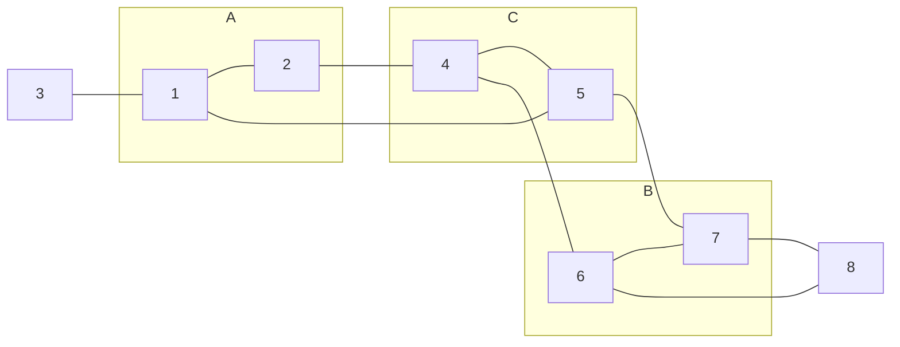
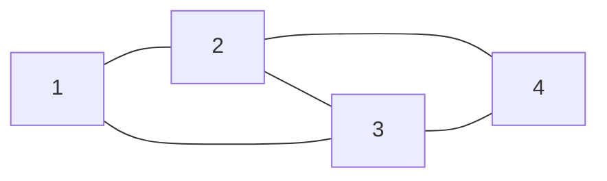


       
# 由MRF到CRF
- **MRF**（ **马尔科夫随机场**）
- **CRF**（ **条件随机场**）
- **softmax与 Log-linear**
- **CRF在NLP中的应用**

---
## *1. MRF*

**MRF**是概率图模型的第二大类，是**概率无向图模型**，表示**联合概率分布**，它包含**⼀组结点**，每个结点都对应着**⼀个变量或⼀组变量**。连接节点的**边是⽆向的**，即不含有箭头，表示两个变量之间的**概率依赖关系**。**MRF**一个例子如图一所示：

$$图一$$
图一中，从集合$A$中的任意结点到集合$B中$的任意结点的每条路径都通过集合$C$中的⾄少⼀个结点。对于所有由这个图描述的任意概率分布，以$C$为条件， $A$与$B$都条件独⽴，即有$$p(A,B|C)=p(A|C)p(B|C)$$
### **1.1 MRF的条件独立性**
在有向图中可以通过**有向分离**(**D-separation**)来判断变量之间的条件独立性。在**MRF**中判断条件独立变得更加简单。

在**MRF**中，某个节点 $X_i$只条件依赖于**相邻节点**，所以节点 $X_i$的**马尔科夫毯**，由**相邻节点的集合**组成，以图中所有剩余变量为条件 ,$X_i$的条件概率分布，只依赖于马尔科夫毯中的变量。

如图一所示，我们有三个结点集合，记作$A$，$B$，$C$。判定上图中是否满足

$A$⊥$B$|$C$(A与B在给定C的条件下条件独立)。可以有两种判断方式。
  **1**.考虑连接集合A与集合B中节点的所有可能路径，如果所有路径都通过了集合C中的一个或多个节点，则$A$⊥$B$|$C$
  **2**.假设从图中把集合$C$中的节点以及节点相关的连接全部删除，观察是否存在一条$A$中任意节点到$B$中任意节点的路径，如果没有该路径则$A$⊥$B$|$C$
  总结起来就是，**判断$A$是不是只能通过$C$到$B$**，若果是，则$A$⊥$B$|$C$
### **1.2 MRF的分解**
**MRF**表示**联合概率分布**，对于给定的概率无向图模型，我们希望将**整体的联合概率分布**写成若干**子联合概率的乘积**的形式，也就是将联合概率进行因子分解，这样更便于模型的学习与计算。
首先给出无向图中**团与最大团**的定义:
无向图$G$中任何两个节点均有边连接的结点子集称为**团**(**clique**).如果$C$是无向图$G$的一个团，并且不能再加进任何一个$G$的结点使其成为一个更大的团，则称此$C$为**最大团**（**maximal clique**）。

$$图二$$
如图二所示，该图表示了一个由4个节点表示的无向图。图中由两个节点组成的团有5个：{1，2}，{1，3}，{2，3}，{2，4}，{3，4}。有2个最大团：{1，2，3}和{2，3，4}。1和4没有边连接，所以{1，2，3，4}不是一个团。

**Hammersley-Clifford 定理**
**MRF**的**联合概率分布**可以表示为其**最大团**上的**随机变量的函数的乘积**形式。给定无向图G，C为G上的最大团，$Y_c$表示C对应的随机变量。那么G的模型的联合概率分布可以写作G中所有最大团C上的函数$Ψ_C(Y_C)$的乘积形式，即
$$P(Y)=\frac{1}{Z}\quad\prod_{C}Ψ_C(Y_C)$$
其中，$Z$是**规范化因子**，
$$Z=\sum_{Y}\quad\prod_{C}Ψ_C(Y_C)$$
规范化因子保证$P(Y)$构成一个概率分布。函数$Ψ_C(Y_C)$称为**势函数**，势函数必须是正的，通常定义为指数函数：
$$Ψ_C(Y_C)=e^{-E(Y_C)}$$
$E(Y_C)$是一个定义在变量$Y_C$上的实值函数，常见形式为
$$E(Y_C)=\sum_{u,v∈C,u≠v}α_{uv}y_uy_v+\sum_{v∈C}β_{v}y_v$$
其中$α_{uv}$和$β_{v}$是参数，$E(Y_C)$中的第一项考虑每一对节点的关系，第二项仅考虑单个节点。
与有向图的联合分布的因⼦不同，⽆向图中的**势函数没有⼀个具体的概率意义**。

具体应用：**图像去噪**

**MRF** 与贝叶斯网络相比有几个优点：
-   它们可以应用于更广泛的问题，其中没有和变量依赖相关的天然方向性。
-   无向图可以简洁地表达某些依赖关系，贝叶斯网络不容易描述它们（尽管反过来也是如此）

**MRF**也有重要的缺点：

-   计算归一化常数$Z$需要对可能为指数数量的赋值进行求和。
如果我们的模型中有M个离散结点，每个结点有K个状态，那么归⼀化项的计算涉及到对$K^M$个状态求和，因此（在最坏的情况下）计算量是模型⼤⼩的指数形式；因此许多**MRF**模型是棘手的并需要近似技术。

---
## *2. CRF*

**条件随机场**（**CRF**）是给定随机变量$X$条件下，随机变量$Y$的马尔科夫随机场。生成式模型直接对联合分布进行建模，而判别式模型则是对条件分布进行建模。**MRF**是生成式模型，而**CRF**是判别式模型。

具体定义，设$X$与$Y$是随机变量，$P(Y|X)$是在给定$X$的条件下$Y$的条件概率分布，若随机变量$Y$构成一个由无向图$G=(V,E)$表示的**MRF**，即$$P(Y_v|X,Y_w,w≠v) = P(Y_v|X,Y_w,w —v) $$对任意的节点v成立，则称条件概率分布$P(Y|X)$为条件随机场（**CRF**），w —v表示与v有边连接的所有节点w，w≠v表示节点v以外的所有节点。

**CRF**对多个变量在给定观测值后的条件概率进行建模。具体来说，若令$X$= {$x_1,x_2,...,x_n$} 为观测序列，$Y$= {$y_1,y_2,...,y_n$} 为与之相应的标记序列，则**CRF**的目标是构建条件概率模型$P(Y|X)$。比较典型的应用有NLP中的词性标注，观测序列为语句（单词序列），标记序列为语句相应的词序序列。

理论上来说，图$G$可以有任意的结构，但在现实应用中，尤其是对标记序列建模时，最常用的是链式结构，即“链式条件随机场”。若在给定随机变量序列$X$的条件下，当随机变量序列Y的条件概率分布$P(X|Y)$满足
$$P(Y_i|X,Y_1,...,Y_{i-1},Y_{i+1},...,Y_n)=P(Y_i|X,Y_{i-1},Y_{i+1})$$
$$i=1,2,...,n$$

则称$P(X|Y)$为线性链条件随机场。
在线性链条件随机场中，最大团是相邻两个结点的集合。$Y_i$只与$Y_{i-1}$、$Y_{i+1}$以及X有关。
如下图所示是线性链条件随机场的例子，

在上图中，从字符图像序列$X_i$中识别单词，输出将是一系列字母$Y_i$。我们可以从它的$X_i$中分别预测每个$Y_i$。 然而，由于这些字母组合在一起形成一个词，所以$Y_i$的预测与$Y_{i+1}$和$Y_{i-1}$也有关系。

### **2.1条件随机场的参数化形式**
由线性链条件随机场描述了$X$和$Y$的关系，以及相邻两个$Y$之间的关系可以初步猜想，线性链CRF的参数化形式应该包含两个部分，一部分描述$X$和$Y$的关系，另一部分描述相邻两个$Y$之间的关系。
势函数$\Phi(X,Y_i)$和$\Phi(Y_{i-1},Y_i)$分别描述这两种关系，我们的目标是求
 
 
 规定条件分布
 
 
   

势函数$\Phi(X,Y_i)$和$\Phi(Y_{i-1},Y_i)$通常定义为指数函数，由上一节提到的**Hammersley-Clifford 定理**可以得出，线性链CRF的参数化形式
$$P(y|x)=\frac{1}{Z(x)}exp\left(\sum_{k}\sum_{i=2}^{n}\lambda_kt_k(y_{i-1},y_i,x,i)+\sum_{l}\sum_{i=1}^{n}\mu_ls_l(y_i,x,i)\right)$$其中$$Z(x)=\sum_{y}exp\left(\sum_{k}\sum_{i=2}^{n}\lambda_kt_k(y_{i-1},y_i,x,i)+\sum_{l}\sum_{i=1}^{n}\mu_ls_l(y_i,x,i)\right)$$
上式中$t_k$和$s_l$是特征函数，$\lambda_k$和$\mu_l$是对应的权值。$Z(x)$是规范化因子，求和是在所有可能的输出序列上进行的。
$t_k$称为转移特征，用于刻画相邻的标记变量（Y）之间的相关关系以及观测序列（X）对他们的影响。下标$k$表示第$k$个特征函数，并且每个特征函数都附属一个权重 $\lambda_k$，每个特征执行一定的限定作用，然后建模再为每个特征函数加权求和。
$s_l$称为状态特征，用于刻画观测序列（X）对标记变量（Y）的影响
通常特征函数$t_k$和$s_l$取值为1或0；当满足特征条件时为1，不满足为0。

### **2.2条件随机场的简化形式**
注意到线性链**CRF**上述的参数化形式中，同一特征函数（例：$t_k$），在各个位置($i$)都有定义，可以对同一个特征在各个位置求和，将局部特征函数转化为一个全局特征函数，这样就可以把**CRF**写成权值向量和特征向量的內积形式。
为了简便，将转移特征函数（$t_k$）与状态特征函数$s_l$做一个拼接，设有$K_1$个转移特征，$K_2$个状态特征，$K=K_1+K_2$，记
$$f_k(y_{i-1},y_i,x,i)=\begin {cases}t_k(y_{i-1},y_i,x,i)& \text{ $k=1,2,...,K_1$ }\\ s_l(y_i,x,i)&\text{ $k=K_1+l;l=1,2,...,K_2$}\\ \end{cases}$$
然后，对转移特征与状态特征在各个位置求和，记做
$$f_k(y,x)=\sum_{i=1}^nf_k(y_{i-1},y_i,x,i)，k=1,2,...,K$$
用$w_k$表示特征$f_k(y,x)$的权值，即
$$w_k=\begin {cases}\lambda_k& \text{ $k=1,2,...,K_1$ }\\\mu_k&\text{ $k=K_1+l;l=1,2,...,K_2$}\\ \end{cases}$$
所以条件随机场又可以简化为
$$P(y|x)=\frac{1}{Z(x)}exp\left(\sum_{k=1}^Kw_kf_k(y,x)\right)$$
其中$$Z(x)=\sum_{y}exp\left(\sum_{k=1}^Kw_kf_k(y,x)\right)$$
用$w$表示权值向量，即$$w=(w_1,w_2,...,w_k)^T$$
以$F(y,x)$,表示全局的特征向量，即
$$F(y,x)=(f_1(y,x),f_2(y,x),...,f_K(y,x))^T$$
那么CRF又可以写成$w$和$F(y,x)$的內积形式：
$$P_w(y|x)=\frac{1}{Z(x)}exp\left(w\cdot F(y,x)\right)$$
其中$$Z(x)=\sum_{y}exp\left(w\cdot F(y,x)\right)$$

通过**CRF**的简化形式，可以看到**CRF**满足**log-linear model**的形式（具体见第3节），实际也可以归入**log-linear model**

一套**CRF**由一套参数$w$唯一确定（先定义好各种特征函数）。CRF用极大似然估计方法、梯度下降、牛顿迭代、拟牛顿下降、IIS、BFGS、L-BFGS等等都可以求解，能用在**log-linear models**上的求参方法都可以用过来。

模型的工作流程：
-   step1. 先预定义特征函数
-   step2. 在给定的数据上，训练模型，确定参数  
-   step3. 用确定的模型做序列标注问题或者序列求概率问题。
---
## 3. softmax与 Log-linear
总体来说，softmax与 Log-linear比较相似，都是对$p(y|x)$进行建模，个人感觉最大的差异在于**特征向量**与**参数向量**的个数。

假设$x$固定，当计算 $p(y|x)$ 时，**softmax**模型对于每一个不同的$y$, 使用不同的参数向量 $w_k$，即当$y = k$时，参数向量为$w_k$；对于每一个不同的$y$, 特征向量却总是同一个，即特征向量只与$x$有关，与$y$无关。参数向量有多个，特征向量只有一个。

而**Log-linear**模型与之不同，对于每一个不同的$y$, Log-linear 模型使用相同的参数向量$v$，但是特征向量是不同的，特征向量与$x$与$y$都相关。参数向量只有一个，特征向量有多个。

下面具体介绍这两种模型，假设$\{(x^{(i)}, y^{(i)}); i = 1, . . . , m\}$ 是包含$m$个训练样本的训练集。$(x^{(i)}, y^{(i)})$ 是训练集中的第 $i$个训练样本。在每一个训练样本$(x^{(i)}, y^{(i)})$中，$x^{(i)}$是对应的输入，$y^{(i)}$是对应的输出。
  ### 3.1 Softmax Model  
我们可以从每个 $x^{(i)}$ 中提取$n$个特征,生成一个$n$维向量：

  $$  
g(x^{(i)}) = \begin{bmatrix}  
g_1(x^{(i)})\\  
g_2(x^{(i)})\\  
\vdots\\  
g_j(x^{(i)})\\  
\vdots\\  
g_n(x^{(i)})  
\end{bmatrix}  
$$  
通常来说, $y^{(i)}$是离散的，并且 $y^{(i)}$取含有K个元素的集合  $\{1,2,...,k,...,K \}$ 中的某个值。

**注意**:特征向量$g(x^{(i)})$只与$x$取值有关，而与$y$无关

举例：
在使用softmax做文本分类的任务中，$x^{(i)}$ 是文本文档，$y^{(i)}$ 是该文档对应的分类。如果 $n$ 是词表的大小，从文本中抽取特征的常用方式之一是“词袋（bag of words）”，在该方式下，$g_j(x^{(i)})$表示词表中的第 $j$个词在当前文档中出现的次数 。 $K$ 是所有训练文档的总类别数。显然，在这个例子中， $g_j(x^{(i)})$只取决于$x^{(i)}$, 而与$y^{(i)}$无关。

给定输入$x^{(i)}$, 我们可以计算 $y^{(i)}$ 被标记为$k$的概率：
$$ \begin{aligned}p(y^{(i)} = k|x^{(i)}) &= \frac{e^{w_k^T \cdot g(x^{(i)})}}{\sum_{l=1}^{K}e^{w_l^T \cdot g(x^{(i)})}} \\  
&= \frac{exp(\sum_{j=1}^n w_{k,j} \times g_j(x^{(i)}))}{\sum_{l=1}^{K} exp(\sum_{j=1}^n w_{l,j} \times g_j(x^{(i)}))}  
\end{aligned}
$$  
其中
$$  
w_k = \begin{bmatrix}  
w_{k,1}\\  
w_{k,2}\\  
\vdots\\  
w_{k,j} \\  
\vdots\\  
w_{k,n}  
\end{bmatrix}  
$$  
并且  
$$  
w_k^T \cdot g(x^{(i)}) = \sum_{j=1}^n w_{k,j} \times g_j(x^{(i)}) \\  
$$    

从上图中我们可以看到,当我们使用softmax 模型计算 $p(y^{(i)} = k|x^{(i)})$ 时,  对于每一个 $y^{(i)} = k$, 我们使用不同的参数向量 $w_k$,总共需要 $K$个参数向量。 但是对于每一个不同的值 $y^{(i)} = k$, 特征向量总是相同的。
  ### 3.2 Log-linear Model  
 在 Log-linear 模型中， $y^{(i)}$ 的取值也是离散的，取值范围也是$\{1,2,...,k,...,K \}$。给定输入$x^{(i)}$, 计算 $y^{(i)}$ 被标记为$k$的概率时，抽取特征向量的方式与softmax是不同的， 在 Log-linear 模型中，我们从每个样本$(x^{(i)},y^{(i)})$中抽取 $n$个特征，生成$n$维的向量。令抽取的特征为：
  $$  
f(x^{(i)},y^{(i)}=k) = \begin{bmatrix}  
f_1(x^{(i)},y^{(i)}=k)\\  
f_2(x^{(i)},y^{(i)}=k)\\  
\vdots\\  
f_j(x^{(i)},y^{(i)}=k)\\  
\vdots\\  
f_n(x^{(i)},y^{(i)}=k)  
\end{bmatrix}  
$$  
**注意**：抽取的特征，同时取决于$x^{(i)}$ 和$y^{(i)}$。
举例：
在使用Log-linear做情感分析的任务中，$x^{(i)}$ 是文本文档, and $y^{(i)}$ 表示文档的分类. 在这里，$K$ 为 3。 $y^{(i)} = 1$表示文档$x^{(i)}$ 是积极的； $y^{(i)} = 2$ 表示文档$x^{(i)}$ 是中性的；$y^{(i)} = 3$ 表示文档 $x^{(i)}$ is 是消极的。下面给出一些特征抽取函数的示例：
$$
\begin{aligned}  
f_1(x^{(i)},y^{(i)}) =  
\begin{cases}  
1 & \text{if } y^{(i)}=1\text{ and “awesome” in } x^{(i)} ,\\  
0 & \text{otherwise} .  
\end{cases}  
\end{aligned}  
$$
$$
\begin{aligned}  
f_2(x^{(i)},y^{(i)}) =  
\begin{cases}  
\text{ count(“awesome” in } x^{(i)}) & \text{if } y^{(i)}=1,\\  
0 & \text{if } y^{(i)} \ne1 .  
\end{cases}  
\end{aligned}  
$$  
显然, 在上面的示例中每一个特征 $f_j(x^{(i)},y^{(i)})$ 都与 $x^{(i)}$ 和 $y^{(i)}$有关。  
给定输入$x^{(i)}$, 我们可以计算 $y^{(i)}$ 被标记为$k$的概率：
$$  
\begin{aligned}  
p(y^{(i)} = k|x^{(i)}) &= \frac{e^{v^T  \cdot f(x^{(i)},y^{(i)}=k)}}{\sum_{l=1}^{K}e^{v^T  \cdot f(x^{(i)},y^{(i)}=l)}} \\  
&= \frac{exp(\sum_{j=1}^n v_j \times f_j(x^{(i)},y^{(i)}=k))}{\sum_{l=1}^{K} exp(\sum_{j=1}^n v_j \times f_j(x^{(i)},y^{(i)}=l))}  
\end{aligned}  
$$  
其中 
$$  
v = \begin{bmatrix}  
v_1\\  
v_2\\  
\vdots\\  
v_j\\  
\vdots\\  
v_n  
\end{bmatrix}  
$$  
并且   
  

$$  
v^T  \cdot f(x^{(i)},y^{(i)}=k)= \sum_{j=1}^n v_j \times f_j(x^{(i)},y^{(i)}=k) \\  
$$  

如上图所示, 在 log-linear model中计算 $p(y^{(i)} = k|x^{(i)})$时，对于每一个$y^{(i)} = k$, 我们使用同一个参数向量 $v$, 而与之对应的特征向量$f(x^{(i)},y^{(i)}=k)$是不同的。

与log-linear model类似，下面这些术语基本上是等同的:
- log-linear model
-  maximum entropy model (maxent)
- exponential family model
- energy-based model
-  Boltzmann distribution
-  conditional random field
他们基本上都是在给定$x$下，对$p(y|x)$进行建模，其中参数向量跨类别共享，即对于$y^{(i)} = k$, 使用同一个参数向量 $v$；而特征向量是不同的。当类别很多（K很大）或者某些类别的训练数据过少时，使用同一个参数向量$v$会更好一些，这样可以减少参数的数目，提高效率。

  ## 4. CRF在NLP中的应用
CRF可以用来做命名实体识别（NER）
CRF可以用在如下的场景：
考虑一个由单词序列$w_1,w_2,...,w_n$组成的文本，这个单词序列对应着一个标签序列$t_1,t_2,...,t_{i-1}$(这里$i<n$),我们的任务是预测下一个单词的标签$t_i$，即构建模型$$P(T_i=t_i|T_1=t_1,...,T_{i-1}=t_{i-1},W_1=w_1,...,W_n=w_n)$$
举例：
文本如下：
**Hispaniola/NNP quickly/RB became/VB an/DT important/JJ base from  
which Spain expanded its empire into the rest of the Western Hemisphere**
这里$w_1,w_2,...,w_n$表示句子Hispaniola quickly...Hemisphere ，前五个词的标签是$t_1,t_2,...,t_5$=NNP RB VB DT JJ,我们要预测$t_{i=6}$的值，即预测单词**base**的标签。

具体应用到**NER**中。具体过程如下：
1.定义实体标注集，可以使用**BMEWO**标注集，各个标注的意义如下：
- **B**: 实体的开头
- **M**:实体的中间部分
- **E**:实体的结束
- **W**:单独成实体
- **O**:句子的其它成分
比如下面这个句子（经过分词处理）：
山西 相立 山泉 饮品 开发 有限公司 生产 的桶装 饮用水 检出 铜绿 假 单胞菌
可以标注为：
山西/B 相立/M 山泉/M 饮品/M 开发/M 有限公司/E 生产/O 的/O 桶装/O 饮用水/O 检出/O 铜绿/O 假/O 单胞菌/O

2.对训练文本进行中文分词、去除停用词的处理，并根据上述的标注集进行标注。在该过程中，还可以引入其他的特征，比如词性特征、是否是特征词(实体通常的结尾词,比如“有限公司”)、是否是地点、是否是句子结束等。

3.定义特征模板（特征模板的说明见参考文献7），自动的在训练文本中提取特征函数，**特征模板的定义直接决定了最后的识别效果**，训练得到CRF模型

4.使用训练得到的CRF模型，进行文本的实体标注集的标签预测，用正则表达式`B+M*E+`或者`W`匹配文本，然后将其背后的文字提取出来，就是识别出来的实体。

### *reference：*
1. PRML-8.3
2. https://juejin.im/entry/5a9ea04b51882555712bdcd6
3. 统计学习方法（李航）第11章 条件随机场
4. 机器学习（周志华）第14章概率图模型
5. https://www.zhihu.com/question/35866596
6. [Log-Linear Models by Michael Collins](http://www.cs.columbia.edu/~mcollins/loglinear.pdf)  
7. https://www.lookfor404.com/%E7%94%A8crf%E5%81%9A%E5%91%BD%E5%90%8D%E5%AE%9E%E4%BD%93%E8%AF%86%E5%88%AB-ner%E7%B3%BB%E5%88%97%EF%BC%88%E4%B8%89%EF%BC%89/

